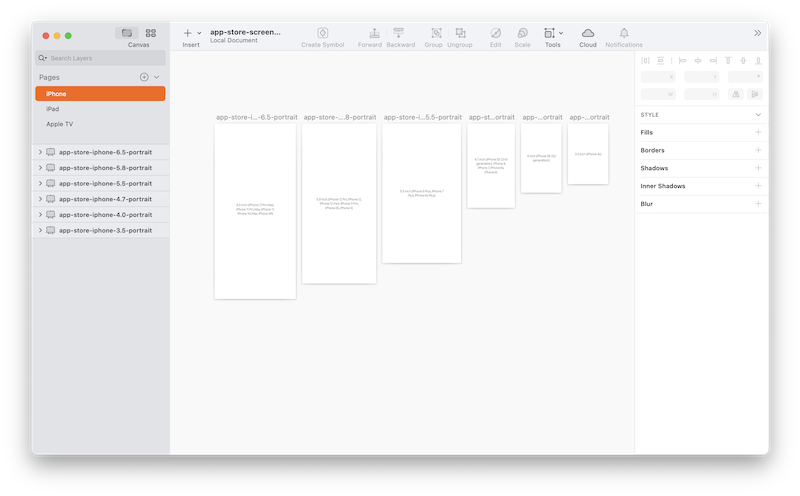

# App Store Screenshots Template

This project provides a basic [Sketch](https://www.sketch.com) template for creating App Store screenshots for iPhone, iPad, and Apple TV devices.

The provided [Sketch file](app-store-screenshots-template.sketch) includes pages for each of the supported device types. Each page includes artboards for all supported screen sizes, pre-configured to export to the correct sizes.

Not all of the sizes are required, so refer to Apple's [Screenshot Specifications](https://help.apple.com/app-store-connect/#/devd274dd925) if you'd prefer to not create assets for each size.